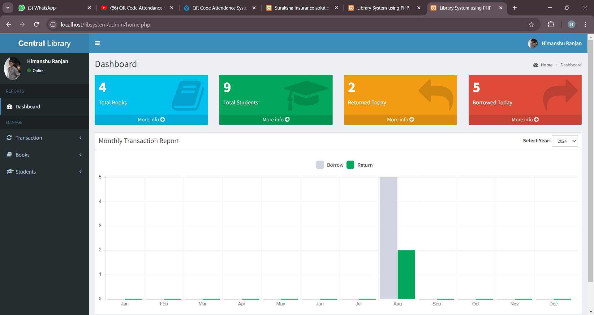

# Library Management System

## **Table of Contents**
- [**Description**](#description)
- [**How to setup this project**](#how-to-setup-this-project)
- [**Technologies Used**](#technologies-used)
- [**features**](#features)
- [**Usage**](#usage)
- [**Preview**](#preview)
- [**Deployed link**](#deployed-link)
- [**Future Development**](#future-development)
- [**Questions**](#questions)


## **Description**

1. **Book Catalog**: Manages the collection of books, including details like title, author, and availability.
2. **User Accounts**: Handles library member registration and login for borrowing and returning books.
3. **Borrowing System**: Tracks issued books, due dates, and overdue fines.
4. **Search Functionality**: Allows users to search for books by title, author, or genre.
5. **Notifications**: Sends reminders for due dates and alerts for new arrivals. **Profile Management and Support**: Create profiles to manage bookings, view history, and access customer support features like chatbots and FAQs.


## **How to setup this project**
```
Step 1st. Download xampp
```
```
Step 2nd. Text editor notepad++ or Sublime
```
```
Step 3rd. Download the zip file/ Download winrar
```
```
Step 4th. Extract the file and copy “libsystem” folder
```
```
Step 5th. Paste inside root directory/ where you install xampp local disk C: drive D: drive E: paste: for xampp/htdocs,
```
```
Step 6th. Open PHPMyAdmin http://localhost/phpmyadmin
```
```
Step 7th. Create database name libsystem
```
```
Step 8th. Import libsystem.sql file given inside the zip package in SQL file folder
```
```
Step 9th. Run the script http://localhost/libsysteme 
```


## **Technologies Used**

1.**Language**:                  PHP
**Databases used**:      MySQL
**Design used**:            HTML JavaScript, Ajax, JQuery, Bootstrap
**Browser used**:          IE8, Google Chrome, Opera Mozilla
**Software used**:         WAMP/ XAMPP/ LAMP/MAMP

## **features** 

1. **Integration of All Student Records**: Centralized database that stores and manages comprehensive student information.
   
2. **Systematic Record Management**: Efficiently organizes and categorizes library data for easy retrieval and management.

3. **Online Information Tracking**: Provides real-time tracking of library activities, including book availability, borrowing history, and overdue books.

4. **Report Generation**: Allows for the creation of detailed reports on various aspects of library operations, such as borrowed books, student activity, and inventory status.

5. **Online Information Management**: Facilitates the online management of library resources, enabling remote access and updates.

6. **Ease of Record Maintenance**: Simplifies the process of maintaining and updating records, reducing manual errors and time spent.

7. **Fast Book Entry**: Streamlines the process of entering new books into the system, speeding up inventory updates.

8. **Book Search Functionality**: Enables students to search for available books to borrow, enhancing user experience and accessibility.

9. **Student Transaction Viewing**: Allows students to view their borrowing history and current transactions, keeping them informed about their activities.

10. **CRUD Operations on Students**: Supports Create, Read, Update, and Delete operations on student records, ensuring data accuracy and completeness.

11. **CRUD Operations on Books**: Enables Create, Read, Update, and Delete operations on book records, allowing for efficient management of the library's inventory.

12. **Borrow and Return Books**: Manages the process of borrowing and returning books, including due dates, late fees, and renewals.

13. **Complete Library Transaction Dashboard**: Provides an overview of all library transactions, including active loans, returns, and overdue books, through an intuitive dashboard.

14. **MySQLi Injection Protection**: Implements security measures to protect the system from SQL injection attacks, ensuring data integrity and security.

15. **Automatic Generation of Student ID**: Automatically generates unique student IDs to streamline the registration and management of student records.
## **Usage**

1. **Cataloging**: Efficient organization and classification of books and materials.

2. **Circulation Management**: Streamlined check-in/check-out process for library items.

3. **User Management**: Easy tracking of library members, their borrowing history, and account details.

4. **Inventory Management**: Real-time tracking of library assets, including books, media, and other resources.

5. **Reporting**: Generation of detailed reports on library usage, inventory status, and user activities.


## **Preview**

* **Library Management System**



* **Final results**


## **Deployed link**

A deployed link is the [ <a href="https://himanshuranjan977.github.io/Online-Bus-Booking-System/" target="_blank">here</a>]  where your project is hosted and accessible to users, allowing them to interact with your application in a real environment.

## **Future Development**

1. **Cloud Integration**: Shift library management systems to cloud platforms for better accessibility, scalability, and data security.

2. **AI-Powered Search**: Implement AI and machine learning algorithms to enhance search functionality, offering personalized book recommendations and efficient resource discovery.

3. **Mobile Accessibility**: Develop mobile applications with features like e-book access, book reservations, and real-time notifications to enhance user engagement.

4. **Blockchain for Digital Rights Management**: Use blockchain technology to manage digital rights and ensure secure, transparent transactions for e-books and other digital resources.

5. **Data Analytics**: Leverage data analytics to track user behavior, optimize inventory, and improve decision-making for acquisitions and library services.

## **Questions**

* Contact me on my GitHub profile: [Himanshu's GitHub](https://github.com/himanshuranjan977)
